# Ottonate

**Automate from napkin to pull request.**

<p align="center">
  
</p>

Ottonate is an autonomous dev pipeline that turns raw product ideas into merged pull requests. Nine Claude agents handle triage, planning, implementation, CI fixes, code review, and post-merge retrospectives. Humans stay in control at five explicit gates: idea review, spec review, backlog review, code review, and merge.

## Pipeline

```mermaid
flowchart LR
    subgraph Ideas
        A["Drop files\nin ideas/"] --> B["Idea Agent\ntriage"]
        B -->|"🧑 Idea Review"| B2["Idea Agent\nrefine"]
        B2 -->|"comment"| B
        B -->|"merge PR"| B3["Pending Gate\nwaits for merge"]
    end

    subgraph Specs
        B3 --> C["Spec Agent\nwrite spec"]
        C -->|"🧑 Spec Review"| D["Planner\ngenerate stories"]
        D -->|"🧑 Backlog Review"| E["Stories created\nin target repos"]
    end

    subgraph Dev
        E --> F["Planner\ndev plan"]
        F --> G["Quality Gate\npass/fail"]
        G --> H["Implementer\nbranch + code + PR"]
        H --> I["CI Fixer\n(if needed)"]
        I --> J["Self Review"]
        J -->|"🧑 Code Review"| K["Review Responder\naddress feedback"]
        K -->|"🧑 Merge"| L["Merged"]
    end

    L --> M["Retro Agent"]
    M -.->|"improves rules\n& architecture"| C

    style A fill:#f9f,stroke:#333
    style L fill:#0d0,stroke:#333
```



> **🧑 = human gate.** The pipeline pauses and waits for a person to review, approve, or merge.

## Why Ottonate

| Problem | How Ottonate Solves It |
|---|---|
| Plans get ignored during implementation | Quality gate agent evaluates every plan against acceptance criteria before a single line of code is written |
| AI-generated code fails review | Self-review agent catches issues before humans see the PR; review-responder addresses feedback inline |
| No memory between issues | Engineering repo accumulates architecture docs, rules, and decisions; every agent reads them |
| External state diverges from code | Retro agent proposes engineering repo updates after every merge, keeping docs current |
| Org patterns break AI output | Three-layer rules system (built-in, org, repo) injects coding conventions into every prompt |
| Ideas get lost before they become work | Drop files in `ideas/`, get a triaged spec issue with a structured INTENT.md |

## Key Concepts

### Labels as State Machine

Every issue carries a permanent entry label (default `otto`) that marks it as pipeline-eligible. A second, mutable label tracks the current stage. The scheduler polls GitHub, finds actionable labels, and dispatches to the right handler. No external workflow engine, no queue infrastructure.

### The Engineering Repo

A dedicated repository (default name `engineering`) that serves as the org-level knowledge base. Contains architecture docs, product specs, backlog decisions, ADRs, and coding conventions. Every agent reads from it. The retro agent writes back to it. Run `ottonate init-engineering` to scaffold it from an org scan.

### The Rules System

Three layers of configuration, most specific wins:

1. **Built-in defaults**: branch patterns, commit formats, label names
2. **Org-level**: `.ottonate/config.yml` and `.ottonate/rules.md` from the engineering repo, plus `architecture/` docs
3. **Repo-level**: `.ottonate/config.yml` and `.ottonate/rules.md` from each target repo

Debug with `ottonate rules-check owner/repo` to see the merged result.

### Human Gates

Five points where the pipeline pauses for human judgment:

| Gate | Label | How to Proceed |
|---|---|---|
| **Idea Review** | `agentIdeaReview` | Comment on the idea PR to refine, or merge to approve |
| **Spec Review** | `agentSpecReview` | Merge or close the spec PR in the engineering repo |
| **Backlog Review** | `agentBacklogReview` | Merge the backlog PR, or comment "backlog approved" |
| **Code Review** | `agentReview` | Approve the PR on GitHub |
| **Merge** | `agentMergeReady` | Merge the PR |

## Agents

| Agent | Role | Model | Key Behavior |
|---|---|---|---|
| `otto-idea-agent` | Triage and refine raw ideas | Sonnet | Reads idea files, writes INTENT.md, creates spec issue |
| `otto-spec-agent` | Generate product specifications | Sonnet | Reads initiative issue, writes SPEC.md |
| `otto-planner` | Produce dev plans and break specs into stories | Sonnet | Analyzes codebase, writes PLAN.md, generates story JSON |
| `otto-quality-gate` | Evaluate plans against acceptance criteria | **Haiku** | Read-only; returns pass/fail/escalate verdict |
| `otto-implementer` | Write code, create PRs | Sonnet | TDD workflow: failing tests first, then implementation, atomic commits |
| `otto-ci-fixer` | Fix CI failures | Sonnet | Reads failure logs, identifies root cause, pushes fix |
| `otto-reviewer` | Self-review PRs | Sonnet | Read-only; checks quality, correctness, plan adherence |
| `otto-review-responder` | Address human review comments | Sonnet | Makes code changes for nitpicks, answers questions, pushes fixes |
| `otto-retro` | Run retrospectives | Sonnet | Proposes engineering repo improvements, can file self-improvement issues |

The quality gate runs on Haiku for speed and cost. Everything else runs on Sonnet.

## Quick Start

### Prerequisites

- Python 3.11+
- [GitHub CLI](https://cli.github.com/) (`gh`) authenticated
- [Claude Code CLI](https://docs.anthropic.com/en/docs/claude-code) (`claude`) installed and authenticated
- [uv](https://docs.astral.sh/uv/) package manager

### Authentication

**Option A: Anthropic API (default)**

```bash
# Interactive OAuth login (opens browser)
claude login

# Or set an API key
export ANTHROPIC_API_KEY=sk-ant-...
```

Verify with `claude --version` and a quick `claude -p "hello"` to confirm the CLI can reach the API.

**Option B: AWS Bedrock**

If your org routes Claude through Bedrock, set the following in `.env`:

```
OTTONATE_USE_BEDROCK=true
OTTONATE_AWS_REGION=us-east-1
OTTONATE_AWS_PROFILE=your-aws-profile    # optional, uses default chain if unset
OTTONATE_BEDROCK_MODEL=us.anthropic.claude-sonnet-4-20250514
```

Standard AWS credential resolution applies (env vars, `~/.aws/credentials`, instance profile, etc.).

### Install and Run

```bash
git clone https://github.com/nate-mcneil/ottonate.git
cd ottonate
uv pip install -e ".[dev]"

ottonate setup               # Interactive onboarding: .env, labels, engineering repo
ottonate init-engineering     # Scaffold engineering repo with auto-discovered architecture docs
ottonate run                  # Start the scheduler daemon
```

After setup, label any issue with `otto` (or your chosen entry label) to feed it into the pipeline.

## Ideas Pipeline

The ideas pipeline (Step 0) lets anyone contribute product ideas without writing a formal spec.

1. **Drop files** in `ideas/{project_name}/` in the engineering repo and open a PR
2. **Idea agent triages** (`agentIdeaTriage`): reads your files, synthesizes a structured `INTENT.md`, creates a linked GitHub issue, labels it `agentIdeaReview`
3. **Human reviews** (`agentIdeaReview`): read the INTENT.md on the PR and leave comments to request changes. Each comment triggers the idea agent to refine (`agentIdeaRefining`) and return to review
4. **Merge the PR** to approve the idea. The linked issue is labeled `agentIdeaPending`, which blocks until the PR merge is detected
5. **Pending gate clears** (`agentIdeaPending`): once the PR merges, the issue is unlocked and fed into the spec pipeline

The idea agent handles the review/refine loop. You provide raw thoughts and feedback; it produces a spec-ready issue.

## CLI Reference

```bash
ottonate setup                       # Interactive onboarding: .env, labels, engineering repo
ottonate run                         # Start the scheduler daemon
ottonate process owner/repo#42       # Push a single issue through one pipeline step
ottonate process-idea owner/repo#42  # Triage and refine a single idea issue
ottonate sync-agents                 # Sync agent definitions to ~/.claude/agents/
ottonate init-engineering            # Bootstrap engineering repo with scaffolding
ottonate rules-check owner/repo      # Display merged rules for a repo
```

## Configuration

All configuration is via environment variables with the `OTTONATE_` prefix, loaded from `.env` by Pydantic settings.

### GitHub

| Variable | Default | Description |
|---|---|---|
| `OTTONATE_GITHUB_ORG` | *(required)* | GitHub organization name |
| `OTTONATE_GITHUB_ENGINEERING_REPO` | `engineering` | Engineering/knowledge repo name |
| `OTTONATE_GITHUB_ENGINEERING_BRANCH` | `main` | Default branch of the engineering repo |
| `OTTONATE_GITHUB_AGENT_LABEL` | `otto` | Entry label that marks issues for the pipeline |
| `OTTONATE_GITHUB_USERNAME` | | Bot account username (for filtering self-comments) |
| `OTTONATE_GITHUB_NOTIFY_TEAM` | | Team/user to @mention on events |

### Model

| Variable | Default | Description |
|---|---|---|
| `OTTONATE_CLAUDE_MODEL` | `sonnet` | Claude model to use |
| `OTTONATE_USE_BEDROCK` | `false` | Route through AWS Bedrock instead of Anthropic API |
| `OTTONATE_AWS_REGION` | | AWS region for Bedrock |
| `OTTONATE_AWS_PROFILE` | | AWS credentials profile |
| `OTTONATE_BEDROCK_MODEL` | | Bedrock model ID (e.g. `us.anthropic.claude-sonnet-4-20250514`) |
| `OTTONATE_BEDROCK_SMALL_MODEL` | | Bedrock model ID for fast/cheap tasks (quality gate) |

### Pipeline Tuning

| Variable | Default | Description |
|---|---|---|
| `OTTONATE_MAX_CONCURRENT_TICKETS` | `3` | Max issues processed in parallel |
| `OTTONATE_POLL_INTERVAL_S` | `30` | Scheduler polling interval in seconds |
| `OTTONATE_IDEA_POLL_ENABLED` | `true` | Enable/disable polling for idea PRs |
| `OTTONATE_IDEAS_DIR` | `ideas` | Directory name for idea files in the engineering repo |
| `OTTONATE_MAX_PLAN_RETRIES` | `2` | Max retries for plan quality gate failures |
| `OTTONATE_MAX_IMPLEMENT_RETRIES` | `2` | Max retries for blocked implementations |
| `OTTONATE_MAX_CI_FIX_RETRIES` | `3` | Max retries for CI fix attempts |
| `OTTONATE_MAX_REVIEW_RETRIES` | `5` | Max review-address cycles |
| `OTTONATE_RATE_LIMIT_BASE_DELAY_S` | `60` | Initial backoff delay for rate limits (seconds) |
| `OTTONATE_RATE_LIMIT_MAX_DELAY_S` | `600` | Max backoff delay (seconds) |
| `OTTONATE_RATE_LIMIT_COOLDOWN_S` | `300` | Scheduler cooldown after rate limit recovery (seconds) |

### Storage

| Variable | Default | Description |
|---|---|---|
| `OTTONATE_WORKSPACE_DIR` | `~/.ottonate/workspaces` | Directory for cloned repo workspaces |

## Instructions for Agents

If you are an AI agent (Claude Code, Cursor, Copilot, etc.) tasked with setting up ottonate for a user, follow these steps:

1. **Clone and install**
   ```bash
   git clone https://github.com/nate-mcneil/ottonate.git
   cd ottonate
   uv pip install -e ".[dev]"
   ```

2. **Verify GitHub CLI auth**
   ```bash
   gh auth status
   ```
   If not authenticated, prompt the user to run `gh auth login` before continuing.

3. **Verify Claude Code CLI auth**
   ```bash
   claude --version
   claude -p "hello"
   ```
   If the CLI is not installed, prompt the user to install it (`npm install -g @anthropic-ai/claude-code`). If not authenticated, prompt the user to run `claude login` or set `ANTHROPIC_API_KEY`. For Bedrock setups, confirm AWS credentials are configured and set the `OTTONATE_USE_BEDROCK` / `OTTONATE_AWS_*` vars in `.env` (see Authentication section above).

4. **Run interactive setup**
   ```bash
   ottonate setup
   ```
   This walks through an 8-step onboarding flow. You will need to respond to prompts:
   - **Owner selection** (numbered list): pick the org or personal account
   - **Engineering repo name**: accept default `engineering` or enter a custom name
   - **Repo creation confirm**: confirm `Y` if the repo does not exist yet
   - **Entry label**: accept default `otto` or enter a custom label
   - **.env overwrite**: confirm only if the user wants to replace an existing `.env`

   The command creates the engineering repo, writes `.env`, provisions pipeline labels, and syncs agent definitions.

5. **Populate architecture docs**
   ```bash
   ottonate init-engineering
   ```
   This scans the org's repos and opens a PR to the engineering repo with auto-discovered architecture documentation.

6. **Start the pipeline**
   ```bash
   ottonate run
   ```

After setup, the user can label any issue with `otto` (or their chosen entry label) to feed it into the pipeline.

## Key Files

| File | Purpose |
|---|---|
| `src/ottonate/pipeline.py` | Core pipeline logic: all stage handlers and agent orchestration |
| `src/ottonate/scheduler.py` | Async polling loop, concurrency control, idea PR polling |
| `src/ottonate/config.py` | All configuration via Pydantic settings |
| `src/ottonate/models.py` | Label enum (state machine), ticket models, stage results |
| `src/ottonate/rules.py` | Three-layer rules loader and merged config resolution |
| `src/ottonate/prompts.py` | Prompt builders for every pipeline stage |
| `src/ottonate/cli.py` | CLI entry points (click) |
| `agents/*.md` | Agent definitions synced to `~/.claude/agents/` at startup |

## Development

```bash
uv pip install -e ".[dev]"
ruff check src/ tests/             # Lint
pytest tests/ -v                   # Test
```

Tests use `pytest` with `pytest-asyncio` in auto mode. Pipeline tests patch `pipeline._run` to avoid real agent invocations.

## License

Proprietary.
